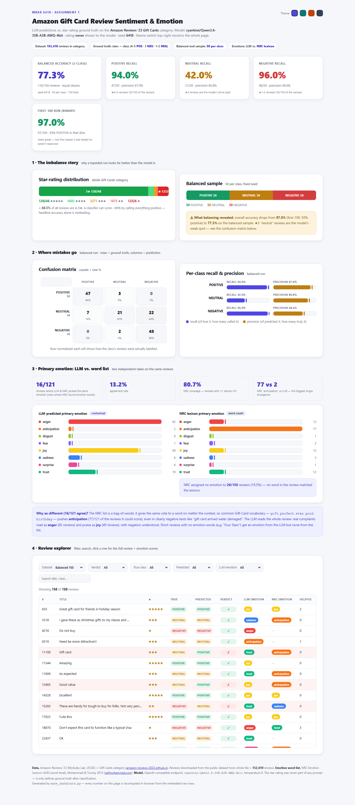
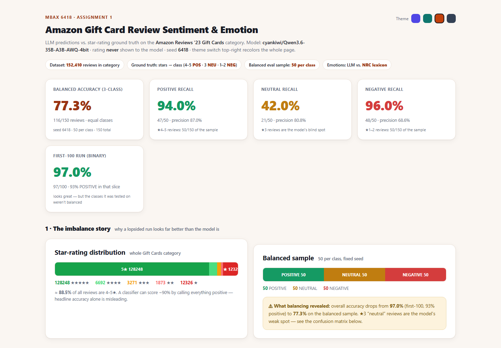

# MBAX 6418 — Assignment 1: Sentiment & Emotion Classification of Amazon Reviews

**Author:** Junkyu Lee · **Course:** MBAX 6418

A working review-sentiment classifier for the Amazon **Gift Cards** review category:
an LLM classifies each review as **POSITIVE / NEUTRAL / NEGATIVE** (and detects its
primary emotion), the predictions are checked against the star rating, and everything
is presented in a single self-contained, interactive dashboard.

- **Model:** `cyankiwi/Qwen3.6-35B-A3B-AWQ-4bit` (OpenAI-compatible endpoint, temperature 0)
- **Star rating is never shown to the model** — it is used only afterwards as ground truth
- **Balanced evaluation sample:** 50 reviews per class, fixed seed `6418` (150 total)



*Figure 1. The finished dashboard (generated by `make_dashboard.py`, rendered offline in a browser).*



*Figure 2. The interactive review explorer with filters, live counts, sortable columns,
expandable rows (full text + NRC word scores), and a theme switcher.*

---

## Headline results

| Run | Reviews | Classes | Correct | Accuracy |
|---|---|---|---|---|
| First 100 rows (in file order) | 100 | POSITIVE / NEGATIVE (binary) | 97 / 100 | **97.0%** |
| Balanced sample (seed 6418) | 150 | POSITIVE / NEUTRAL / NEGATIVE | 116 / 150 | **77.3%** |

The first-100 slice is 93% positive (91 five-star reviews), so a classifier that
mostly says "positive" looks excellent there. On a balanced sample each class carries
equal weight and the true picture appears: the model is strong on positive and negative
reviews but weak on **neutral (3-star)** ones.

### Balanced run — per-class metrics

| Class | n | Recall | Precision |
|---|---|---|---|
| POSITIVE (★4–5) | 50 | 94.0% (47/50) | 87.0% (47/54) |
| NEUTRAL (★3) | 50 | **42.0%** (21/50) | 80.8% (21/26) |
| NEGATIVE (★1–2) | 50 | 96.0% (48/50) | 68.6% (48/70) |

### Confusion matrix (rows = ground truth, columns = prediction)

| GT \ Predicted | POSITIVE | NEUTRAL | NEGATIVE |
|---|---|---|---|
| **POSITIVE** | 47 (94%) | 3 (6%) | 0 (0%) |
| **NEUTRAL** | 7 (14%) | 21 (42%) | 22 (44%) |
| **NEGATIVE** | 0 (0%) | 2 (4%) | 48 (96%) |

---

## 1 · Why did the lopsided run look very accurate, and what did balancing change?

The Gift Cards category is extremely skewed: of **152,410** reviews, the star
distribution is **★5 = 128,248 (84.1%), ★4 = 6,692 (4.4%), ★3 = 3,271 (2.1%),
★2 = 1,873 (1.2%), ★1 = 12,326 (8.1%)**, i.e. **88.5% of reviews are 4–5★** and only
2.1% are 3★.

The first-100 slice was even more lopsided (91 five-star + 2 four-star = 93% positive).
A model that just copied the majority class would score ~93% on it; the actual run
scored 97% — only 3 errors out of 100 (2 false negatives on 5★ reviews, 1 false
positive on a 3★ review). *The headline number was dominated by the easy class.*

Balancing the sample (50 per class, fixed seed) dropped overall accuracy to **77.3%**.
Per-class recall shows where the loss came from: NEUTRAL recall **42%** vs
POSITIVE **94%** and NEGATIVE **96%**. The same model that appears 97% accurate is
actually much weaker once every class is weighted equally.

## 2 · Where do the mistakes go — which classes get confused with which?

The concrete numbers from the matrix above:

- **NEUTRAL → NEGATIVE: 22/50 (44%)** — the dominant failure. 3-star reviews whose
  text is a mild complaint ("Could not use", "Why don't you include the amount?!",
  "Disappointed in the bent tin.") are pushed into the negative class.
- **NEUTRAL → POSITIVE: 7/50 (14%)** — mild-praise 3★ reviews ("Good value",
  "Attractive box and good gift for friends", "Oh boy!") are called positive.
  So ★3 reviews collapse in **both** directions, but roughly **3× more often into
  NEGATIVE (22) than into POSITIVE (7)**.
- **POSITIVE → NEUTRAL: 3/50 (6%)** — short, non-effusive ★5 reviews ("Gift card",
  "Gift cards are neat", "Pretty") get downgraded to neutral.
- **NEGATIVE → NEUTRAL: 2/50 (4%)** — real complaints expressed mildly
  ("These are handy… Not very…", "One Star") get softened to neutral.
- No POSITIVE ↔ NEGATIVE confusion at all in the balanced run: the model never
  mistakes strong praise for strong complaint or vice versa.

The model's neutral class exists but is under-used as a target: 70 reviews were
predicted NEGATIVE overall (vs 50 true), so the model over-commits to negative
when it is unsure — precision for NEGATIVE is consequently lower (**68.6%**).

## 3 · How do the LLM's emotions and the word list's emotions differ, and why?

Two independent emotion detectors were run over the same 150 balanced reviews:

1. **LLM** — the classifier prompt was extended to also return one primary emotion
   from the eight NRC emotion names (anger, anticipation, disgust, fear, joy,
   sadness, surprise, trust).
2. **Word list** — the **NRC Emotion Lexicon v0.92 (word-level)** scores each
   review's tokens; per-emotion association flags are summed and the highest wins
   (ties broken by canonical order).

**Agreement was low: 16/121 = 13.2%** of the reviews where the lexicon produced an
answer (the lexicon found no emotion word at all in **29/150 reviews, 20% coverage gap**).

The distributions (per 150 reviews):

| Emotion | LLM | NRC |
|---|---|---|
| anger | **65** | 12 |
| anticipation | 2 | **77** |
| disgust | 0 | 1 |
| fear | 1 | 3 |
| joy | **49** | 12 |
| sadness | 8 | 3 |
| surprise | 6 | 1 |
| trust | 19 | 12 |

The biggest divergence is anticipation (77 vs 2). Why:

- **NRC is a bag-of-words.** It scores each word in isolation and sums votes. Gift-Card
  vocabulary is saturated with words the lexicon links to *anticipation* —
  `gift`, `perfect`, `star`, `good`, `birthday` all carry anticipation associations —
  so a negative review like *"gift card arrived water damaged"* still ends up as
  anticipation because the word *gift* outvotes *damaged*. The lexicon also cannot
  see negation or sarcasm ("nothing to show", "worthless" + positive body).
- **LLM reads the whole context.** It weighs all clauses, understands negation, and
  labels by the *strongest expressed feeling*: real complaints come out as anger (65),
  praise as joy (49) — including in reviews where a single gift-y word would dominate
  a word count.
- **Short reviews with no emotion words** (e.g. "Four Stars", "Ease of use.") get an
  emotion from the LLM but **no emotion at all from the lexicon** (coverage 80.7%,
  ~2.95 lexicon-hit tokens per review on average) — the two methods cannot even
  produce comparable answers on 1 in 5 reviews.

In short: NRC measures *which emotion words appear*; the LLM measures *what emotion
the writer is actually expressing*. They diverged most where reviews mention gift-giving
topic words while conveying a different feeling, and where reviews have no emotion
words at all.

## 4 · Bugs and issues hit along the way (and how they were worked around)

- **Python environment had no `requests`/`pip` in the project venv** (a `uv`-created
  minimal venv), so the classifier couldn't run at first.
  *Workaround: installed `requests` into the venv with `uv pip install`, and used the
  same venv for everything (pandas, Pillow).*
- **`outputs/` directory missing at first run** — the balanced-run script crashed
  writing `dataset_stats.json`.
  *Workaround: the script now creates its own output directory (`os.makedirs`).*
- **Dashboard rendered half-empty** — the hero tiles drew, but all charts and the
  table were blank ("Showing 0 of 0 reviews"). Root cause: the JS looked up a stats
  element by `getElementById` that was actually a *class* in the HTML, so the first
  statement after the tiles threw a `TypeError` and the rest of the page never
  rendered. This was caught by rendering the page to a full-page PNG and reviewing
  it visually, then confirmed against the browser console.
  *Workaround: fixed the element id; the generator now also prints every headline
  number (accuracy, recall, precision, confusion, emotion agreement) in Python so
  the page can be cross-checked against the saved output.*
- **Analysis bug: pandas `NaN` vs empty-string comparison** — early emotion-agreement
  counting inflated NRC coverage to 100% because `""` was read back as `NaN`.
  *Workaround: `fillna('')` before comparing; the corrected agreement is 16/121 = 13.2%.*
- **Minor data-format issue**: the star-rating keys in the dataset-stats JSON were
  serialised as `"1.0"` strings, breaking an `int()` conversion in the dashboard
  generator. *Workaround: parse with `int(float(k))`.*
- **Process note**: interactive testing of the dashboard (filters, counts, sort,
  row expansion, theme switch) was automated with Playwright — every filter count
  was checked against the recorded CSVs (e.g. mismatch filter = 34 rows =
  150 − 116; first-100 mismatch filter = 3 rows), catching zero regressions.

---

## Data

**Amazon Reviews '23** — the large-scale review dataset collected by the **McAuley Lab
(UCSD)**:

- Dataset page: <https://amazon-reviews-2023.github.io>
- Category file used (Gift Cards, gzipped JSON Lines): raw JSONL download at
  <https://mcauleylab.ucsd.edu/public_datasets/data/amazon_2023/raw/review_categories/Gift_Cards.jsonl.gz>
- Whole file: **152,410 reviews**; fields used: `rating`, `title`, `text`,
  `verified_purchase`, `helpful_vote`, `asin`, `timestamp`.

**NRC Emotion Lexicon v0.92 (word-level)** — public word–emotion association lexicon
used for the word-list emotion detector:

- Mohammad, S. M., & Turney, P. D. (2013). *Crowdsourcing a word-emotion association
  lexicon.* Computational Intelligence, 29(3), 436–465.
- Resource page: <https://saifmohammad.com/WebPages/NRC-Emotion-Lexicon.htm>
- The extracted word-level file is committed at `data/NRC-Emotion-Lexicon-Wordlevel-v0.92.txt`.

## Reproducibility

- **Fixed sample:** `run_balanced.py --seed 6418 --per-class 50` picks the same
  150 reviews (50 per class) every run; the first-100 run reads the file's first
  100 rows in order (also fixed).
- **Fixed model settings:** temperature 0, model `cyankiwi/Qwen3.6-35B-A3B-AWQ-4bit`.
- **Saved artifacts** (committed): raw API responses
  (`outputs/balanced_raw.jsonl`), parsed results (`results_*.csv`), NRC-scored
  emotions (`outputs/emotions_*.csv`), data distribution
  (`outputs/dataset_stats.json`), and the generated dashboard (`dashboard.html`).
- Every number quoted in this report is a figure you can re-derive from those files.

## Repository layout

| File | Role |
|---|---|
| `prompt.md` | The reusable classification prompts (binary + full JSON) |
| `review_classifier.py` | LLM client: binary and full (sentiment+emotion) modes |
| `run_eval.py` | Step 2 script — first-100 row binary run → `results_100.csv` |
| `run_balanced.py` | Step 6 script — seeded balanced 3-class + emotion run → `results_balanced.csv`, `outputs/balanced_raw.jsonl`, `outputs/dataset_stats.json` |
| `nrc_emotions.py` | Step 5 word-list script — NRC lexicon scoring → `outputs/emotions_*.csv` |
| `make_dashboard.py` | Dashboard generator → `dashboard.html` |
| `dashboard.html` | Final self-contained dashboard (opened directly in a browser) |
| `results_*.csv`, `outputs/`, `screenshots/` | Saved outputs and report figures |
| `data/NRC-Emotion-Lexicon-Wordlevel-v0.92.txt` | Word-list lexicon (committed for offline reproducibility) |

The raw `Gift_Cards.jsonl.gz` is **not** committed (12 MB, re-downloadable from the
link above); `run_balanced.py` reads it from the working directory.

## How to run

```bash
# 1. get the data (12 MB)
curl -L -o Gift_Cards.jsonl.gz \
  "https://mcauleylab.ucsd.edu/public_datasets/data/amazon_2023/raw/review_categories/Gift_Cards.jsonl.gz"

# 2. Python env (requests + pandas)
uv venv .venv && uv pip install --python .venv/Scripts/python.exe requests pandas

# 3. Step 2: first-100 binary run
.venv/Scripts/python.exe run_eval.py

# 4. Step 6: balanced 3-class + emotion run (calls the class LLM endpoint)
.venv/Scripts/python.exe run_balanced.py --seed 6418 --per-class 50 --workers 4

# 5. Step 5: NRC word-list emotions
.venv/Scripts/python.exe nrc_emotions.py

# 6. Step 3/4/7: rebuild the dashboard
.venv/Scripts/python.exe make_dashboard.py
```
