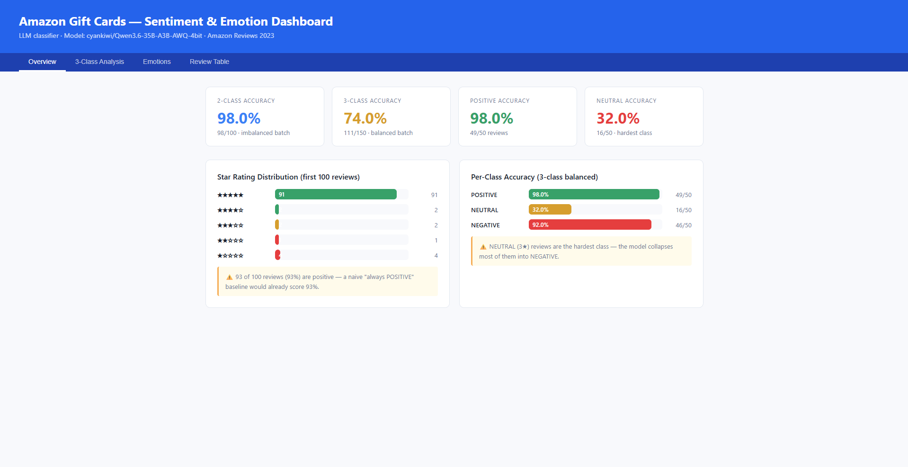
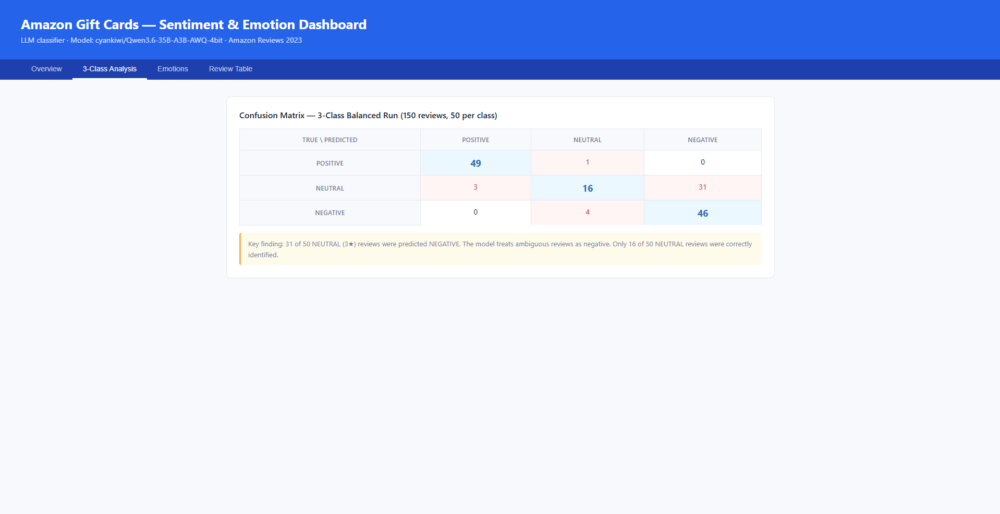
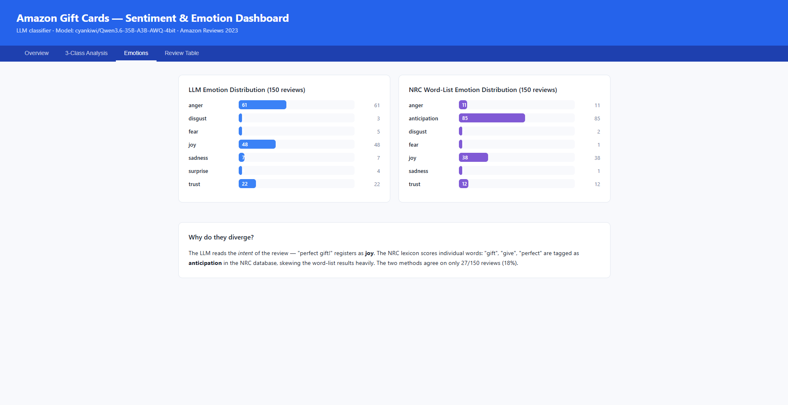
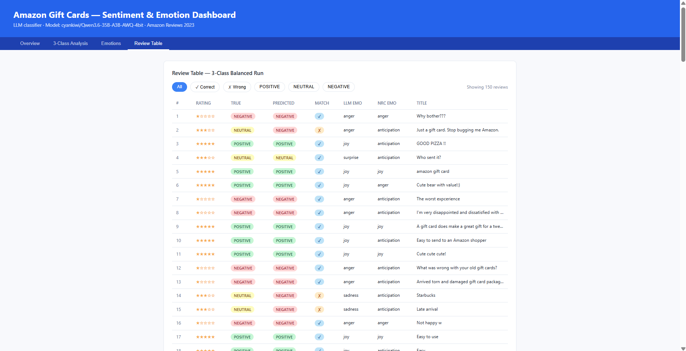

# MBAX 6418 — Assignment 1: Sentiment & Emotion Classification of Amazon Reviews

**Author:** Junkyu Lee  
**Course:** MBAX 6418  
**Dataset:** Amazon Reviews 2023 — Gift Cards category  
**Model:** `cyankiwi/Qwen3.6-35B-A3B-AWQ-4bit` via OpenAI-compatible endpoint

---

## Project Overview

This project builds an LLM-based sentiment classifier for Amazon product reviews. The classifier predicts sentiment labels **solely from review text and title** — star ratings are never passed to the model. Star ratings are used only afterwards to derive ground-truth labels and measure accuracy.

---

## Repository Contents

| File | Description |
|------|-------------|
| `assignment.ipynb` | Full pipeline: Steps 1–2 (2-class), Step 5 (emotion detection), Step 6 (3-class balanced), Step 7 (dashboard generation) |
| `results_100.json` | 100-review 2-class results (98% accuracy) |
| `results_balanced.json` | 150-review 3-class balanced results (74% accuracy) |
| `dashboard_final.html` | **Final interactive dashboard — open this in a browser** |
| `README.md` | This file |

---

## Data Source

**Amazon Reviews 2023** (McAuley Lab, UC San Diego)  
- Category: Gift Cards  
- URL: https://mcauleylab.ucsd.edu/public_datasets/data/amazon_2023/raw/review_categories/Gift_Cards.jsonl.gz  
- Citation: Hou, Y., Li, J., He, Z., Yan, A., Chen, X., & McAuley, J. (2024). Bridging Language and Items for Retrieval and Recommendation. *arXiv preprint arXiv:2403.03952*.

---

## Methodology

### LLM Endpoint
- **Base URL:** `http://dobolyi.com:9001/v1`
- **API Key:** `6418`
- **Model:** `cyankiwi/Qwen3.6-35B-A3B-AWQ-4bit`
- **Key parameter:** `extra_body={"chat_template_kwargs": {"enable_thinking": False}}` — required to disable Qwen3's internal chain-of-thought reasoning

### Sentiment Labels (Ground Truth from Star Ratings)
- **2-class:** POSITIVE (≥ 4★) vs NEGATIVE (< 4★)
- **3-class:** POSITIVE (4–5★), NEUTRAL (3★), NEGATIVE (1–2★)

> ⚠️ **The model never sees the star rating.** Labels are derived post-prediction and used only for accuracy evaluation.

### NRC Emotion Lexicon
Loaded directly from the installed NRCLex package:  
`/usr/local/lib/python3.13/dist-packages/nrclex/data/nrc_en.json`  
8 emotions scored: anger, anticipation, disgust, fear, joy, sadness, surprise, trust.

---

## Results Summary

### Step 2 — 2-Class Classifier (first 100 reviews, imbalanced)

| Metric | Value |
|--------|-------|
| Accuracy | **98.0%** (98/100) |
| POSITIVE reviews | 93 of 100 (93%) |
| NEGATIVE reviews | 7 of 100 (7%) |
| Wrong predictions | 2 |

### Step 6 — 3-Class Classifier (150 reviews, balanced: 50 per class)

| Class | Correct | Accuracy |
|-------|---------|----------|
| POSITIVE | 49/50 | **98.0%** |
| NEUTRAL | 16/50 | **32.0%** |
| NEGATIVE | 46/50 | **92.0%** |
| **Overall** | **111/150** | **74.0%** |

**Confusion Matrix:**

|              | Pred: POSITIVE | Pred: NEUTRAL | Pred: NEGATIVE |
|--------------|:--------------:|:-------------:|:--------------:|
| True: POSITIVE | **49** | 1 | 0 |
| True: NEUTRAL  | 3 | **16** | 31 |
| True: NEGATIVE | 0 | 4 | **46** |

### Step 5 — Emotion Detection (150 balanced reviews)

| Emotion | LLM Count | NRC Count |
|---------|:---------:|:---------:|
| anger | 61 | 11 |
| anticipation | 0 | **85** |
| disgust | 3 | 2 |
| fear | 5 | 1 |
| joy | 48 | 38 |
| sadness | 7 | 1 |
| surprise | 4 | 0 |
| trust | 22 | 12 |

**LLM vs NRC agreement: 27/150 reviews (18%)**

---

## Dashboard

Open `dashboard_final.html` in any browser. It has four tabs:

1. **Overview** — Stat cards, star distribution bar chart, per-class accuracy bars
2. **3-Class Analysis** — Full confusion matrix with key findings
3. **Emotions** — LLM vs NRC emotion distribution comparison with explanation
4. **Review Table** — All 150 reviews with filtering by class and correctness

### Screenshots

**Tab 1 — Overview**


**Tab 2 — 3-Class Analysis**


**Tab 3 — Emotions**


**Tab 4 — Review Table**


---

## Report: Discussion Questions

### Q1. Why did the first 100-review run look so accurate, and what did balanced sampling change?

The first run scored **98% accuracy** but is misleading due to severe class imbalance: 93 of 100 reviews (93%) were 5-star or 4-star POSITIVE reviews. A trivial "always predict POSITIVE" baseline would have scored 93% on this batch — so a well-tuned LLM getting 98% represents only a marginal 5-point improvement over guessing. The model essentially learned that gift card reviews skew positive, and the dataset confirmed it.

Balanced sampling with `random.seed(42)` forced 50 reviews per class (POSITIVE, NEUTRAL, NEGATIVE), giving each class equal weight. This dropped overall accuracy to **74%** and revealed that the model struggles with 3★ NEUTRAL reviews — exposing a real weakness that the first run completely hid.

---

### Q2. Confusion matrix analysis — which classes get confused and in what direction?

The dominant error is **NEUTRAL → NEGATIVE misclassification**: 31 of 50 NEUTRAL reviews (62%) were predicted NEGATIVE. POSITIVE and NEGATIVE classes are nearly perfect (98% and 92%). The model essentially has no reliable "middle ground" — when a review is ambiguous (mixed feelings, mild complaint, or underwhelming praise), it defaults to NEGATIVE.

This makes intuitive sense: 3-star reviews often mention something that went wrong alongside something that was fine. The LLM, trained to be cautious and pick up on complaints, reads the negative phrasing and ignores the moderate overall tone. The error is asymmetric — almost no NEGATIVE reviews were mistakenly called POSITIVE — which suggests the model is biased toward flagging negativity.

---

### Q3. How do LLM emotions and NRC emotions differ, and why?

The two methods produce **very different distributions** and agree on only 27 of 150 reviews (18%).

**LLM:** Dominant emotions are `anger` (61) and `joy` (48), with `trust` (22) third. The LLM reads the *intent and tone* of the whole review — an angry complaint registers as anger, a happy gift giver registers as joy.

**NRC:** Dominant emotion is `anticipation` (85), dwarfing everything else. This is because the NRC word list scores individual words without context. Words like "gift", "give", "receive", "send", and "card" are tagged as `anticipation` in the NRC database — and these words appear constantly in gift card reviews regardless of sentiment. The word-list method is overwhelmed by the domain vocabulary and misses the actual emotional tone.

**Key insight:** The NRC lexicon was designed for general text. In a highly domain-specific corpus like gift card reviews, neutral transactional vocabulary (gift, card, send) floods the anticipation category. The LLM avoids this by reading meaning, not just word counts.

---

### Q4. What bugs and issues were encountered and how were they resolved?

**Bug 1 — Qwen3 thinking mode returning `content=None`:**  
The model uses a chain-of-thought reasoning mode by default. With `max_tokens=20`, all tokens were consumed by internal reasoning and `response.choices[0].message.content` returned `None`, causing an `AttributeError`. Fix: add `extra_body={"chat_template_kwargs": {"enable_thinking": False}}` to every API call and increase `max_tokens=50`.

**Bug 2 — NRCLex `affect_frequencies` AttributeError:**  
The installed version of NRCLex did not have the `affect_frequencies` attribute documented in older tutorials. Fix: load the bundled JSON lexicon directly from `nrclex/data/nrc_en.json` and compute emotion scores manually by iterating over words.

**Bug 3 — `IsADirectoryError` with NRCLex:**  
`NRCLex("")` treated an empty string as a file path, resolving to the `/content` directory. Fix: never pass an empty string to NRCLex; use the direct JSON approach instead.

**Bug 4 — 404 error for NRC lexicon from GitHub:**  
An attempt to download the NRC lexicon from a third-party GitHub URL returned 404. Fix: use the lexicon already bundled with the installed `nrclex` package.

**Bug 5 — IndentationError in HTML f-string generation:**  
Building HTML with embedded Python list comprehensions inside triple-quoted f-strings caused `IndentationError` in Colab. Fix: pre-compute all data strings (star bars, accuracy bars, confusion matrix rows, emotion bars) as separate variables before the final HTML concatenation.

**Observation — Class imbalance masking performance:**  
The first run's 98% accuracy is technically correct but misleading. This is documented explicitly in the dashboard with a warning note, and motivated the balanced sampling design in Step 6.

---

## Setup & Running in Google Colab

```python
# Install dependencies
!pip install openai nrclex requests --quiet

# Open assignment.ipynb in Colab and run all cells in order:
# Steps 1–2  → produces results_100.json
# Step 5     → adds emotion labels to balanced results
# Step 6     → produces results_balanced.json
# Step 7     → produces dashboard_final.html
```

All code uses `random.seed(42)` for reproducibility.

---

*MBAX 6418 Assignment 1 — Junkyu Lee*
